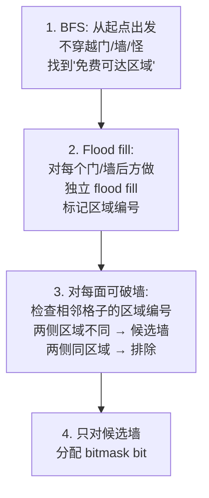
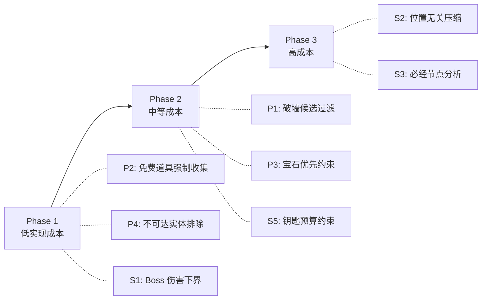

# 激进剪枝策略深度分析

## 现有剪枝回顾

当前求解器有两个剪枝机制：

```javascript
// 1. 药水上界剪枝（solver.js L121-123）
if (current.hp + remainingPotionUpperBound(ml, current.mask) <= bestBossHp) { ... }

// 2. 状态去重（solver.js L288-293）
const sig = stateSignature(nextState);  // floorId|x,y|atk|def|ykeys|bkeys|picks|mask
const seen = best.get(sig);
if (seen != null && seen >= hp) { ... }
```

这两个剪枝在简单场景下足够，但面对大量怪物/门/破墙稿时，状态空间仍然爆炸。以下按**预处理阶段**（搜索前）和**搜索阶段**（搜索中）分类分析可行的激进策略。

---

## 一、预处理阶段剪枝（在 adapter 或 solver 初始化阶段执行）

### 策略 P1：可达区域分析 + 破墙稿候选过滤

**用户提到的"破墙稿只用在隔离空间的分隔墙"。**

**原理**：当前所有 `canBreak` 墙都分配了 bitmask bit。但绝大多数墙即使破坏了也不会连通新的区域（例如被其他墙包围的内墙）。只有位于两个**不同连通区域边界**的墙才值得破。

**算法**：




**预期效果**：一层 50 面墙 → 可能只剩 3-8 面有意义的候选墙。bitmask 从 50 bit 降到 <10 bit，状态空间缩小 2^42 倍以上。

**正确性**：完全正确。排除的墙即使破坏也不会连通新区域（因为另一侧要么也是墙，要么已经可达），因此永远不会出现在最优解中。

**实现难度**：中等。需要在 adapter 中增加 flood-fill 预处理。

**注意**：需要考虑门/钥匙的间接连通——有些墙后方虽然直接不可达，但开门后可达。更保守的做法：将门视为可穿越的，只将墙视为隔断。

---

### 策略 P2：免费道具强制收集

**原理**：从起点出发，不经过任何怪物、不消耗任何钥匙/破墙稿就能拿到的道具（药水、宝石、钥匙），永远应该在做任何战斗之前全部收集——没有理由不拿。

**算法**：

1. BFS 从起点出发，只走空地和已消耗的动态实体
2. 遇到 potion/gem/key → 标记为"免费道具"
3. 在构建 level 时，将这些道具直接计入 hero 初始属性（HP+药水、ATK+红宝石、DEF+蓝宝石、keys+钥匙），并在 mask 中预设对应 bit

**预期效果**：

- 减少搜索初期的无效探索（不需要在"先拿药水还是先打怪"之间搜索）
- 初始 ATK/DEF 更高 → 战斗伤害计算更早收敛 → 更多怪物的"无法击杀"判断更早触发
- 如果有 5 个免费道具，消除 5! = 120 种排列

**正确性**：完全正确。免费道具没有任何副作用（不消耗资源），且所有道具都是纯增益（HP+、ATK+、DEF+、keys+），拿了只会更好。

**实现难度**：低。只需一次 BFS + 修改初始状态。

---

### 策略 P3：宝石优先度约束（用户提到的"必须先拿宝石"思想的泛化）

**用户提到的"最多打 x 只怪就必须拿宝石否则必然亏血"。**

**原理**：宝石提升 ATK/DEF，这会**降低后续每一场战斗的伤害**。如果一颗宝石可达（不需要打怪就能拿到），那么在打任何怪之前拿到它总是更优的。更广义地：如果宝石 G 只需要打 k 只怪就能拿到，那么这 k 只怪的战斗顺序之后必须紧跟着拿 G。

**形式化**：设宝石 G 提供 +d ATK/DEF。假设还有 N 只怪要打。在拿 G 之前打一只多余的怪 M，相比先拿 G 再打 M，多受的伤害为 `delta = damage(atk, def, M) - damage(atk+d, def, M)`。这个 delta 总是 >= 0。因此，**在其他条件相同时，宝石应尽早收集**。

**实现方式**：

- 在预处理阶段为每颗宝石计算"获取成本"（需要穿越的最少怪物数或 HP 消耗）
- 在搜索中，如果当前 mask 包含某些怪物但不包含更"便宜"的宝石，直接剪枝

**正确性**：在简化模型中正确（没有宝石挡住宝石的情况）。但如果一颗宝石被另一颗宝石堵住（需要先打怪到达第一颗宝石才能拿第二颗），需要更复杂的分析。

**实现难度**：中高。需要为宝石建立"获取代价"模型，并在 stateSignature 逻辑中嵌入约束。

---

### 策略 P4：不可达实体排除

**原理**：有些动态实体从起点完全不可达（被墙/门永久隔断）。给它们分配 bitmask bit 是浪费。

**算法**：

1. 从起点 BFS，将所有门视为可穿越
2. 不可达的实体从 dynamics 中移除，不分配 bit

**预期效果**：减少 mask 位数。如果有 5 个不可达实体，mask 减少 5 bit。

**正确性**：完全正确。不可达实体永远不会被交互。

**实现难度**：低。一次 BFS 即可。

---

## 二、搜索阶段剪枝（在主搜索循环中执行）

### 策略 S1：增强上界——宝石 + 药水联合估算

**原理**：当前上界只考虑"剩余药水能恢复多少 HP"。可以增强为：同时考虑"剩余宝石如果全部拿到，打剩余怪物的总伤害下界是多少"。

**公式**：

```
tighterBound = current.hp
             + remainingPotionHeal(mask)
             - minimumRemainingDamage(mask, atk + remainingAtkGems, def + remainingDefGems)
```

其中 `minimumRemainingDamage` 计算：在获取所有剩余宝石后的最大 ATK/DEF 下，打所有剩余怪物（包括 boss）的总伤害下界。

**问题**：`minimumRemainingDamage` 取决于路径（不知道哪些怪必须打），但可以用 boss 伤害作为下界（boss 必须打）。

```
bossDmg = damage(atk + allRemainingAtkGems, def + allRemainingDefGems, boss)
tighterBound = current.hp + remainingPotionHeal - bossDmg
```

**预期效果**：比纯药水上界更紧，能更早剪掉注定不够 HP 的分支。

**正确性**：完全正确（因为是上界估算）。

**实现难度**：低。只需在求解器初始化时预计算最大可能 ATK/DEF 和对应的 boss 伤害。

---

### 策略 S2：位置无关压缩

**原理**：在一个连通区域内，如果所有道具都已被收集，所有怪都已被打败，那么勇士在该区域内的**具体位置不重要**——只有他要从哪个出口离开才重要。

**示例**：一个 5x5 的空房间里有 3 瓶药水，勇士拿完所有药水后在房间里走来走去产生大量不同位置的状态，但这些状态实质等价。

**实现方式**：

1. 预处理阶段将地图划分为"区域"（由墙/门/怪分隔的连通区）
2. 在 stateSignature 中：如果当前区域内所有 dynamics 都已被消耗（mask 对应位全部为 1），则用"区域 ID"代替精确 `(x,y)` 坐标

**预期效果**：对于大面积空旷区域，状态数可降低一个数量级。

**正确性**：完全正确。区域内所有道具已收集后，位置只影响到达出口的步数（不影响 HP/ATK/DEF）。

**实现难度**：高。需要预处理区域划分 + 动态检测区域清空状态。

---

### 策略 S3：必经节点分析

**原理**：某些实体是到达 boss 的**必经之路**——比如 boss 被一道黄门封锁，而地图上只有一把黄钥匙。那么这把钥匙和这道门必然在最优路径上，可以约束搜索。

**更强的推论**：如果通往 boss 的唯一路径经过节点序列 A → B → C → Boss，那么搜索可以被分解为多个子问题。

**实现方式**：

1. 构建实体依赖图（到达 boss 需要哪些门/墙，打开这些门需要哪些钥匙，拿到这些钥匙需要打哪些怪...）
2. 识别"瓶颈节点"——所有通往 boss 路径的必经实体
3. 对必经节点强制顺序约束，减少搜索分支

**预期效果**：如果存在强结构（线性关卡），可以将搜索分解为多段，每段独立求解。

**正确性**：正确，前提是依赖分析准确。

**实现难度**：高。需要图论分析（割点、必经边）。

---

### 策略 S4：战斗伤害的单调性剪枝

**原理**：`damage(atk, def, monster)` 对 atk 递减、对 def 递减。也就是说：

- 当前 ATK 下打某怪受伤 X
- 如果将来 ATK 只可能更高（宝石只增不减），那么将来打这只怪受伤 <= X
- **推论**：如果在当前 ATK/DEF 下打所有剩余怪+boss 的总伤害 T，那么最终打这些怪的伤害 <= T

这可以做一个更紧的**伤害上界**：

```
maxPossibleDamageFromRemainingMonsters = sum of damage(currentAtk, currentDef, m) for each remaining monster m
```

如果 `current.hp + remainingPotionHeal < maxPossibleDamageFromRemainingMonsters`，虽然不能直接剪枝（因为不是所有怪都要打），但如果 boss 伤害单独就超出预算，可以安全剪枝。

**实现难度**：低。只需计算 boss 伤害。

---

### 策略 S5：钥匙/破墙稿预算约束

**原理**：如果到达 boss 的**所有路径**都需要至少 K 把黄钥匙，但当前持有 + 剩余可获取的黄钥匙总数 < K，可以立即剪枝。

**算法**：预计算"到达 boss 的最少钥匙/破墙稿需求"（类似最短路，但边权是钥匙消耗）。搜索中检查这个约束。

**预期效果**：对钥匙/门密集的关卡效果显著。

**实现难度**：中。需要资源感知的可达性分析。

---

## 三、综合评估与推荐优先级


| 策略              | 正确性  | 实现难度 | 预期收益       | 推荐优先级 |
| --------------- | ---- | ---- | ---------- | ----- |
| P2 免费道具强制收集     | 安全   | 低    | 高          | 1     |
| P4 不可达实体排除      | 安全   | 低    | 中          | 2     |
| S1 增强上界(boss伤害) | 安全   | 低    | 中          | 3     |
| P1 破墙稿候选过滤      | 安全   | 中    | 极高(仅破墙稿场景) | 4     |
| P3 宝石优先度约束      | 条件安全 | 中高   | 高          | 5     |
| S4 战斗伤害单调性      | 安全   | 低    | 中          | 6     |
| S5 钥匙预算约束       | 安全   | 中    | 中          | 7     |
| S2 位置无关压缩       | 安全   | 高    | 高(大地图)     | 8     |
| S3 必经节点分析       | 安全   | 高    | 极高(线性关卡)   | 9     |


## 四、推荐实施路径




Phase 1 的三个策略可以在 1-2 天内实现，且**不改变搜索算法本身的结构**，只是在预处理阶段优化输入和在搜索阶段加强剪枝条件。预计可将中等规模关卡（30 个实体）的搜索时间降低 50-80%。

Phase 2 需要更深入的图论预处理，但对破墙稿和宝石密集场景效果极为显著。

Phase 3 涉及搜索算法结构的根本变化（区域抽象、问题分解），适合在前两阶段效果不足时才考虑。