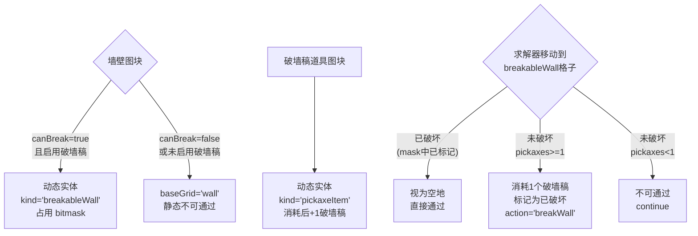

# 破墙稿支持：可行性分析与实现方案

## 一、mota-js 中破墙稿的游戏机制

**破墙稿道具**（`pickaxe`，地图编号 47，cls: `items`）：

- 消耗类道具，使用一次消耗一个
- 使用时破坏勇士面前（当前朝向）的一面可破坏墙壁
- 也有"四方向破"变体（同时破四面墙）

**可破坏墙壁**（maps.js 中 `canBreak: true` 的图块）：

```
"1": {"id":"yellowWall", "canBreak":true, ...}
"2": {"id":"whiteWall", "canBreak":true, ...}
"3": {"id":"blueWall",  "canBreak":true, ...}
"109": {"id":"magentaWall","canBreak":true, ...}
```

当前求解器的 `WALL_IDS = Set(['yellowWall', 'whiteWall', 'blueWall', 'magentaWall'])` 恰好就是这 4 种墙 -- 它们全部可被破墙稿破坏。

## 二、核心难点：状态空间爆炸

### 当前架构中墙壁的角色

墙壁目前是**静态障碍物**，存储在 `baseGrid[y][x] = 'wall'`，求解器直接跳过墙壁格子：

```javascript
if (curFloor.baseGrid[ny][nx] === 'wall') continue;  // solver.js L135
```

墙壁不参与状态，不占用 bitmask。

### 引入破墙稿后的变化

破墙稿让墙壁变成了**可选择性消除的障碍**。这带来两个维度的状态扩展：

1. `**pickaxes` 计数器**：勇士持有多少个破墙稿（类似 yellowKeys/blueKeys）
2. **哪些墙已被破坏**：需要追踪每面墙的状态（完整/已破）

### 定量分析

设一层地图有 **W 面可破坏墙壁**，可获取的破墙稿总数为 **P 个**：

```
状态空间增长因子 = (P+1) x C(W, 0..P) 
                 = (P+1) x sum(C(W,k), k=0..P)
```

典型场景分析：


| 场景   | 墙壁数 W | 破墙稿 P | 墙壁组合数      | 可行性  |
| ---- | ----- | ----- | ---------- | ---- |
| 小型关卡 | 10    | 1     | 11         | 完全可行 |
| 中型关卡 | 30    | 2     | 466        | 可行   |
| 中型关卡 | 30    | 3     | 4,526      | 较可行  |
| 大型关卡 | 50    | 3     | 20,876     | 边界可行 |
| 大型关卡 | 50    | 5     | 2,369,936  | 有风险  |
| 极端情况 | 80    | 10    | ~2 billion | 不可行  |


**结论**：当破墙稿数量 <= 3 且墙壁数 <= 50 时，搜索空间增长可控。超过此范围需要更激进的剪枝策略。

## 三、实现方案

### 核心设计思路：将可破坏墙从 baseGrid 迁移到 dynamics




这样做的优势：

- **完全复用现有 bitmask 机制** -- 破坏墙壁等同于"消耗"一个动态实体
- **与门/钥匙模式一致** -- 破墙稿=钥匙，可破坏墙=门
- **状态去重自然生效** -- stateSignature 包含 mask + pickaxes

### 具体改动

#### 1. [src/types.js](mota-optimal-solver/src/types.js)

- `DynamicEntity.kind` 枚举新增 `'breakableWall'` 和 `'pickaxeItem'`
- `PathStep.after` 新增 `pickaxes: number`

#### 2. [src/adapter.js](mota-optimal-solver/src/adapter.js)

需要一个**开关**控制是否启用破墙稿模式（因为绝大多数关卡不需要它，且它会显著增加状态空间）：

- `buildSimplifiedLevel` 和 `buildMultiFloorLevel` 的 options 新增 `enablePickaxe: boolean`（默认 false）
- 当 `enablePickaxe = true` 时：
  - `WALL_IDS` 中的墙不再直接放入 baseGrid，而是创建 `kind: 'breakableWall'` 动态实体
  - `pickaxe` 道具（地图编号 47）创建 `kind: 'pickaxeItem'` 动态实体
- 当 `enablePickaxe = false` 时（默认）：行为与现在完全一致

关键代码变化位置（以 buildSimplifiedLevel 为例）：

```javascript
// 现在：
if (WALL_IDS.has(id)) {
  baseGrid[y][x] = 'wall';
  continue;
}

// 改为：
if (WALL_IDS.has(id)) {
  if (options.enablePickaxe && block.canBreak) {
    const index = dynamics.length;
    const bit = 1n << BigInt(index);
    dynamics.push({ index, bit, x, y, kind: 'breakableWall', id });
    dynamicIndexByPos.set(coordKey(x, y), index);
  } else {
    baseGrid[y][x] = 'wall';
  }
  continue;
}
```

#### 3. [src/solver.js](mota-optimal-solver/src/solver.js)

- 状态新增 `pickaxes: 0`
- `stateSignature` 加入 `pickaxes`
- 动态实体交互逻辑新增两个分支：

```javascript
} else if (dynamic.kind === 'breakableWall') {
  if (pickaxes < 1) continue;       // 没有破墙稿，无法通过
  pickaxes -= 1;
  mask |= dynamic.bit;
  action = 'breakWall';
  detail = { id: dynamic.id, costPickaxes: 1 };
} else if (dynamic.kind === 'pickaxeItem') {
  pickaxes += 1;
  mask |= dynamic.bit;
  action = 'getPickaxe';
  detail = { id: dynamic.id, deltaPickaxes: 1 };
}
```

- **对已破坏的墙的处理**：当 breakableWall 的 bit 已在 mask 中（consumed = true），solver 应视其为空地直接通过，不触发任何交互（当前逻辑中 consumed 的实体被跳过后默认为 `action = 'move'`，这正是期望行为）

#### 4. [src/cli.js](mota-optimal-solver/src/cli.js)

- 新增 `--enable-pickaxe` 开关
- 路径输出中显示 `pickaxes` 计数

#### 5. 测试

- 破墙稿获取并破墙通过的基本路径
- 无破墙稿时墙壁不可通过
- 多个破墙稿选择最优墙壁的路径
- 黄门/蓝门与破墙稿共存场景

## 四、剪枝优化建议（后续可选）

如果基础实现后遇到大规模地图性能问题，可考虑：

1. **破墙稿上界剪枝**：类似 `remainingPotionUpperBound`，计算"即使获取所有剩余破墙稿，并破最优的墙，HP 仍不可能超过当前最优解"
2. **可达性预过滤**：预分析只有哪些墙是"边界墙"（一侧已连通，另一侧有有价值的实体），只对这些墙分配 bitmask
3. **增加 `--max-pickaxe-walls` 参数**：限制最多破多少面墙，硬性截断搜索深度

## 五、风险总结


| 风险     | 等级  | 说明                                    |
| ------ | --- | ------------------------------------- |
| 状态空间爆炸 | 中   | 受限于 P<=3 时可控，需通过 `enablePickaxe` 开关隔离 |
| 向后兼容   | 低   | 默认 enablePickaxe=false，不影响现有行为        |
| 实现复杂度  | 低   | 完全复用现有 dynamics/bitmask 机制            |
| 结果正确性  | 低   | 与门/钥匙模式一致，不引入新的算法复杂性                  |


